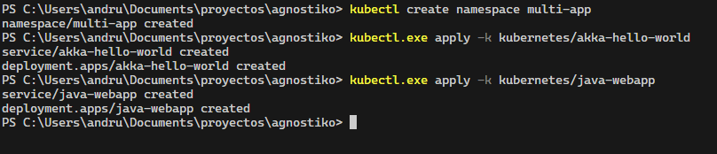

# Kubernetes Multi-Application Deployment

This project demonstrates the deployment of two sample applications in a local Kubernetes environment. The applications are:

1. Akka HTTP Hello World (Scala)
2. Java Web Application (JSP/Servlet)

## Prerequisites

- Docker and Kubernetes
- kubectl CLI tool
- Make (Optional)
- Access to Harbor registry (harbor.andrusdiaz.dev, Only for uploading images)

## Project Structure

```
.
├── dockerfiles/            # Dockerfiles for both applications
│   ├── akka-hello-world/
│   │   └── Dockerfile
│   └── java-webapp/
│       └── Dockerfile
├── kubernetes/            # Kubernetes manifests
│   ├── akka-hello-world/
│   │   ├── deployment.yaml
│   │   ├── kustomization.yaml
│   │   └── service.yaml
│   └── java-webapp/
│       ├── deployment.yaml
│       ├── kustomization.yaml
│       └── service.yaml
├── Makefile              # Automation script
└── img                   # Doc images
```

## Quick Start

The project includes a Makefile that automates all the necessary steps. To get started:

1. **Show available commands:**
   ```bash
   make help
   ```

2. **Deploy everything in one command:**
   ```bash
   make all
   ```

3. **View application logs:**
   ```bash
   make logs
   ```

4. **Clean up everything:**
   ```bash
   make clean
   ```

## Manual Setup Instructions

If you prefer to run the commands manually, follow these steps:

1. **Build Docker Images**
   ```bash
   # Build App1 (Akka HTTP)
   docker build -t harbor.andrusdiaz.dev/agnostiko/akka-hello-world:1.0 -f dockerfiles/akka-hello-world/Dockerfile .
   docker build -t harbor.andrusdiaz.dev/agnostiko/akka-hello-world:2.0 -f dockerfiles/akka-hello-world/Dockerfile .

   # Build App2 (Java Web)
   docker build -t harbor.andrusdiaz.dev/agnostiko/java-webapp:1.0 -f dockerfiles/java-webapp/Dockerfile .
   ```

2. **Push Docker Images to Harbor**
   ```bash
   # Push App1 images
   docker push harbor.andrusdiaz.dev/agnostiko/akka-hello-world:1.0
   docker push harbor.andrusdiaz.dev/agnostiko/akka-hello-world:2.0

   # Push App2 image
   docker push harbor.andrusdiaz.dev/agnostiko/java-webapp:1.0
   ```

3. **Deploy Applications**
   ```bash
   # Create namespace
   kubectl create namespace multi-app

   # Deploy Akka
   kubectl.exe apply -k kubernetes/akka-hello-world

   # Deploy java-webapp
   kubectl.exe apply -k kubernetes/java-webapp
   ```

   

4. **Verify Deployments**
   ```bash
   # Check pods
   kubectl get pods -n multi-app
   ```
   

   ```bash
   # Check services
   kubectl get services -n multi-app
   ```
   

## Accessing the Applications

- App1 (Akka HTTP): http://152.53.88.89:30001/health
- App2 (Java Web): http://152.53.88.89:30002?name=Usuario


## Monitoring and Logs

To view logs for each application:

```bash
# akka-hello-world logs
kubectl logs -f deployment/akka-hello-world -n multi-app
```


```bash
# java-webapp logs
kubectl logs -f deployment/java-webapp -n multi-app
```


## Rolling Updates

To perform a rolling update:

```bash
# Update akka
kubectl set image deployment/akka-hello-world akka-hello-world=harbor.andrusdiaz.dev/agnostiko/akka-hello-world:2.0 -n multi-app
```


## Rollback

To rollback to previous version:

```bash
# Rollback akka
kubectl rollout undo deployment/akka-hello-world -n multi-app
```


## Cleanup

To remove all resources:

```bash
# Remove Kubernetes resources
kubectl delete namespace multi-app
```

## Resource Configuration

Both applications are configured with:
- Resource Requests: CPU 100m, Memory 128Mi
- Resource Limits: CPU 200m, Memory 256Mi
- Liveness and Readiness probes configured
- Rolling update strategy with maxSurge and maxUnavailable set to 1 